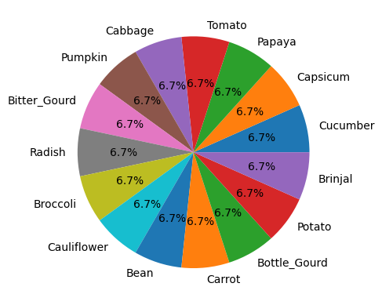
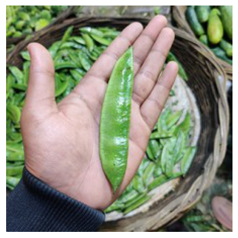
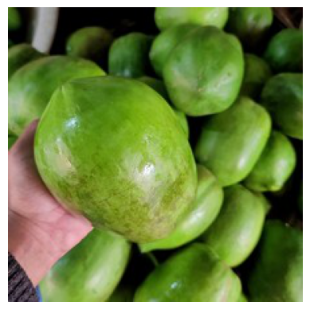
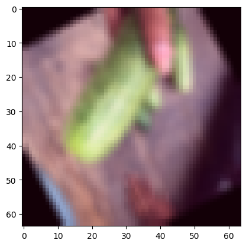
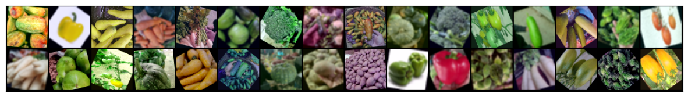
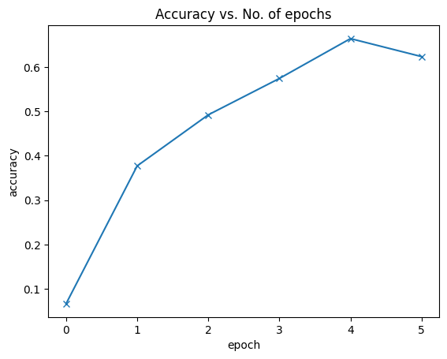
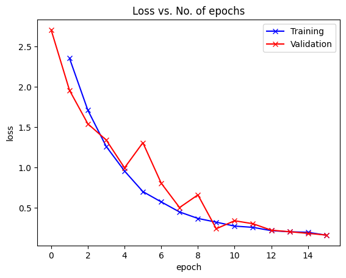
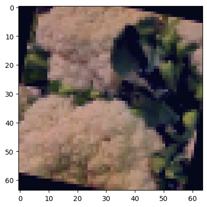
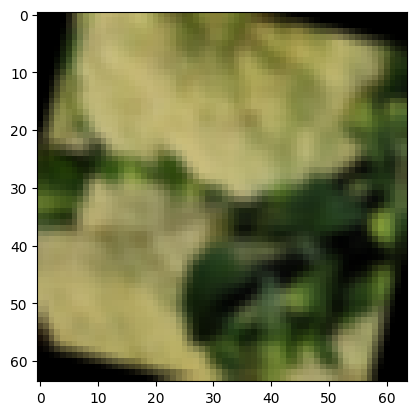
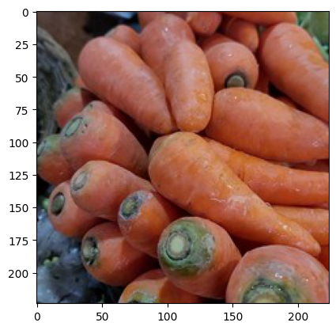

= Vegetable_Recognition
Sadashiv

== Vegetable_Recognition

=== Downloading the dataset

....
Downloading vegetable-image-dataset.zip to ./vegetable-image-dataset
....

....
100%|██████████| 534M/534M [00:04<00:00, 117MB/s]
....

....
....

=== Introduction to Dataset

....
Total Categories in the dataset: 15
{'Cucumber': 1000, 'Capsicum': 1000, 'Papaya': 1000, 'Tomato': 1000, 'Cabbage': 1000, 'Pumpkin': 1000, 'Bitter_Gourd': 1000, 'Radish': 1000, 'Broccoli': 1000, 'Cauliflower': 1000, 'Bean': 1000, 'Carrot': 1000, 'Bottle_Gourd': 1000, 'Potato': 1000, 'Brinjal': 1000}

....

=== Importing the dataset into pytorch

....
torch version: 2.0.1+cu118
....

....
Total images in train dataset: 15000

Sample image from train dataset
....

....
Total images in train dataset: 3000

Sample image from validation_dataset
....

Image transformation

....
Shape of the image: torch.Size([3, 64, 64])

The image after transformation
(tensor([[[0.7098, 0.6980, 0.7216,  ..., 0.6157, 0.6000, 0.6118],
         [0.7137, 0.7020, 0.7255,  ..., 0.6157, 0.5922, 0.5961],
         [0.7216, 0.7098, 0.7255,  ..., 0.6078, 0.5686, 0.5686],
         ...,
         [0.7765, 0.7804, 0.8000,  ..., 0.7490, 0.7922, 0.7882],
         [0.7686, 0.7882, 0.8235,  ..., 0.7843, 0.7882, 0.7843],
         [0.7569, 0.7843, 0.8275,  ..., 0.8078, 0.7843, 0.7843]],

        [[0.6431, 0.6392, 0.6706,  ..., 0.4431, 0.4353, 0.4353],
         [0.6510, 0.6431, 0.6745,  ..., 0.4392, 0.4314, 0.4314],
         [0.6627, 0.6510, 0.6706,  ..., 0.4314, 0.4196, 0.4196],
         ...,
         [0.6078, 0.6039, 0.6039,  ..., 0.6627, 0.7098, 0.7059],
         [0.5804, 0.5804, 0.5725,  ..., 0.6980, 0.7059, 0.6980],
         [0.5725, 0.5686, 0.5529,  ..., 0.7255, 0.6980, 0.7020]],

        [[0.8235, 0.8118, 0.8431,  ..., 0.4627, 0.4667, 0.4627],
         [0.8275, 0.8196, 0.8471,  ..., 0.4588, 0.4627, 0.4588],
         [0.8392, 0.8275, 0.8431,  ..., 0.4471, 0.4549, 0.4549],
         ...,
         [0.6353, 0.6314, 0.6275,  ..., 0.7647, 0.8039, 0.7961],
         [0.6078, 0.6078, 0.5922,  ..., 0.8000, 0.7961, 0.7804],
         [0.5961, 0.5922, 0.5725,  ..., 0.8235, 0.7882, 0.7765]]]), 0)

Sample image
....

=== DataLoader

....
cpu_count in machine: 2
....

....
(torch.Size([32, 3, 64, 64]), torch.Size([32]))
....

=== Visualize some images from dataloader

....
'cuda'
....

=== Model Training

....
ResNet9(
  (conv1): Sequential(
    (0): Conv2d(3, 64, kernel_size=(3, 3), stride=(1, 1), padding=(1, 1))
    (1): BatchNorm2d(64, eps=1e-05, momentum=0.1, affine=True, track_running_stats=True)
    (2): ReLU(inplace=True)
  )
  (conv2): Sequential(
    (0): Conv2d(64, 128, kernel_size=(3, 3), stride=(1, 1), padding=(1, 1))
    (1): BatchNorm2d(128, eps=1e-05, momentum=0.1, affine=True, track_running_stats=True)
    (2): ReLU(inplace=True)
    (3): MaxPool2d(kernel_size=2, stride=2, padding=0, dilation=1, ceil_mode=False)
  )
  (res1): Sequential(
    (0): Sequential(
      (0): Conv2d(128, 128, kernel_size=(3, 3), stride=(1, 1), padding=(1, 1))
      (1): BatchNorm2d(128, eps=1e-05, momentum=0.1, affine=True, track_running_stats=True)
      (2): ReLU(inplace=True)
    )
    (1): Sequential(
      (0): Conv2d(128, 128, kernel_size=(3, 3), stride=(1, 1), padding=(1, 1))
      (1): BatchNorm2d(128, eps=1e-05, momentum=0.1, affine=True, track_running_stats=True)
      (2): ReLU(inplace=True)
    )
  )
  (conv3): Sequential(
    (0): Conv2d(128, 256, kernel_size=(3, 3), stride=(1, 1), padding=(1, 1))
    (1): BatchNorm2d(256, eps=1e-05, momentum=0.1, affine=True, track_running_stats=True)
    (2): ReLU(inplace=True)
    (3): MaxPool2d(kernel_size=2, stride=2, padding=0, dilation=1, ceil_mode=False)
  )
  (conv4): Sequential(
    (0): Conv2d(256, 512, kernel_size=(3, 3), stride=(1, 1), padding=(1, 1))
    (1): BatchNorm2d(512, eps=1e-05, momentum=0.1, affine=True, track_running_stats=True)
    (2): ReLU(inplace=True)
    (3): MaxPool2d(kernel_size=2, stride=2, padding=0, dilation=1, ceil_mode=False)
  )
  (res2): Sequential(
    (0): Sequential(
      (0): Conv2d(512, 512, kernel_size=(3, 3), stride=(1, 1), padding=(1, 1))
      (1): BatchNorm2d(512, eps=1e-05, momentum=0.1, affine=True, track_running_stats=True)
      (2): ReLU(inplace=True)
    )
    (1): Sequential(
      (0): Conv2d(512, 512, kernel_size=(3, 3), stride=(1, 1), padding=(1, 1))
      (1): BatchNorm2d(512, eps=1e-05, momentum=0.1, affine=True, track_running_stats=True)
      (2): ReLU(inplace=True)
    )
  )
  (classifier): Sequential(
    (0): AdaptiveAvgPool2d(output_size=1)
    (1): Flatten(start_dim=1, end_dim=-1)
    (2): Dropout(p=0.2, inplace=False)
    (3): Linear(in_features=512, out_features=15, bias=True)
  )
)
....

....
Looking in indexes: https://pypi.org/simple, https://us-python.pkg.dev/colab-wheels/public/simple/
Collecting torchinfo
  Downloading torchinfo-1.8.0-py3-none-any.whl (23 kB)
Installing collected packages: torchinfo
Successfully installed torchinfo-1.8.0
....

....
==========================================================================================
Layer (type:depth-idx)                   Output Shape              Param #
==========================================================================================
ResNet9                                  [1, 15]                   --
├─Sequential: 1-1                        [1, 64, 64, 64]           --
│    └─Conv2d: 2-1                       [1, 64, 64, 64]           1,792
│    └─BatchNorm2d: 2-2                  [1, 64, 64, 64]           128
│    └─ReLU: 2-3                         [1, 64, 64, 64]           --
├─Sequential: 1-2                        [1, 128, 32, 32]          --
│    └─Conv2d: 2-4                       [1, 128, 64, 64]          73,856
│    └─BatchNorm2d: 2-5                  [1, 128, 64, 64]          256
│    └─ReLU: 2-6                         [1, 128, 64, 64]          --
│    └─MaxPool2d: 2-7                    [1, 128, 32, 32]          --
├─Sequential: 1-3                        [1, 128, 32, 32]          --
│    └─Sequential: 2-8                   [1, 128, 32, 32]          --
│    │    └─Conv2d: 3-1                  [1, 128, 32, 32]          147,584
│    │    └─BatchNorm2d: 3-2             [1, 128, 32, 32]          256
│    │    └─ReLU: 3-3                    [1, 128, 32, 32]          --
│    └─Sequential: 2-9                   [1, 128, 32, 32]          --
│    │    └─Conv2d: 3-4                  [1, 128, 32, 32]          147,584
│    │    └─BatchNorm2d: 3-5             [1, 128, 32, 32]          256
│    │    └─ReLU: 3-6                    [1, 128, 32, 32]          --
├─Sequential: 1-4                        [1, 256, 16, 16]          --
│    └─Conv2d: 2-10                      [1, 256, 32, 32]          295,168
│    └─BatchNorm2d: 2-11                 [1, 256, 32, 32]          512
│    └─ReLU: 2-12                        [1, 256, 32, 32]          --
│    └─MaxPool2d: 2-13                   [1, 256, 16, 16]          --
├─Sequential: 1-5                        [1, 512, 8, 8]            --
│    └─Conv2d: 2-14                      [1, 512, 16, 16]          1,180,160
│    └─BatchNorm2d: 2-15                 [1, 512, 16, 16]          1,024
│    └─ReLU: 2-16                        [1, 512, 16, 16]          --
│    └─MaxPool2d: 2-17                   [1, 512, 8, 8]            --
├─Sequential: 1-6                        [1, 512, 8, 8]            --
│    └─Sequential: 2-18                  [1, 512, 8, 8]            --
│    │    └─Conv2d: 3-7                  [1, 512, 8, 8]            2,359,808
│    │    └─BatchNorm2d: 3-8             [1, 512, 8, 8]            1,024
│    │    └─ReLU: 3-9                    [1, 512, 8, 8]            --
│    └─Sequential: 2-19                  [1, 512, 8, 8]            --
│    │    └─Conv2d: 3-10                 [1, 512, 8, 8]            2,359,808
│    │    └─BatchNorm2d: 3-11            [1, 512, 8, 8]            1,024
│    │    └─ReLU: 3-12                   [1, 512, 8, 8]            --
├─Sequential: 1-7                        [1, 15]                   --
│    └─AdaptiveAvgPool2d: 2-20           [1, 512, 1, 1]            --
│    └─Flatten: 2-21                     [1, 512]                  --
│    └─Dropout: 2-22                     [1, 512]                  --
│    └─Linear: 2-23                      [1, 15]                   7,695
==========================================================================================
Total params: 6,577,935
Trainable params: 6,577,935
Non-trainable params: 0
Total mult-adds (G): 1.52
==========================================================================================
Input size (MB): 0.05
Forward/backward pass size (MB): 24.12
Params size (MB): 26.31
Estimated Total Size (MB): 50.48
==========================================================================================
....

....
image shape:  torch.Size([32, 3, 64, 64])
images device:  cpu
preds.shape torch.Size([32, 15])
....

....
[{'validation_loss': 2.708531379699707,
  'validation_accuracy': 0.06648936122655869}]
....

image:Vegetable_Recognition_files/figure-asciidoc/cell-28-output-1.png[Vegetable_Recognition_files/figure-asciidoc/cell-28-output-1]

....
Target: Bean
Prediction: Bean
....

....
Looking in indexes: https://pypi.org/simple, https://us-python.pkg.dev/colab-wheels/public/simple/
Collecting onnx
  Downloading onnx-1.14.0-cp310-cp310-manylinux_2_17_x86_64.manylinux2014_x86_64.whl (14.6 MB)
     ━━━━━━━━━━━━━━━━━━━━━━━━━━━━━━━━━━━━━━━━ 14.6/14.6 MB 86.8 MB/s eta 0:00:00
Requirement already satisfied: numpy in /usr/local/lib/python3.10/dist-packages (from onnx) (1.22.4)
Requirement already satisfied: protobuf>=3.20.2 in /usr/local/lib/python3.10/dist-packages (from onnx) (3.20.3)
Requirement already satisfied: typing-extensions>=3.6.2.1 in /usr/local/lib/python3.10/dist-packages (from onnx) (4.5.0)
Installing collected packages: onnx
Successfully installed onnx-1.14.0
....

....
============= Diagnostic Run torch.onnx.export version 2.0.1+cu118 =============
verbose: False, log level: Level.ERROR
======================= 0 NONE 0 NOTE 0 WARNING 0 ERROR ========================
....

....
     ━━━━━━━━━━━━━━━━━━━━━━━━━━━━━━━━━━━━━━━━ 0.0/5.9 MB ? eta -:--:--     ━━━━━━━━━━━━━━━━━━━━━━━━━━━━━━━━━━━━━━━╺ 5.8/5.9 MB 174.3 MB/s eta 0:00:01     ━━━━━━━━━━━━━━━━━━━━━━━━━━━━━━━━━━━━━━━━ 5.9/5.9 MB 93.9 MB/s eta 0:00:00
     ━━━━━━━━━━━━━━━━━━━━━━━━━━━━━━━━━━━━━━━━ 46.0/46.0 kB 5.6 MB/s eta 0:00:00
     ━━━━━━━━━━━━━━━━━━━━━━━━━━━━━━━━━━━━━━━━ 86.8/86.8 kB 11.2 MB/s eta 0:00:00
....

....
Predicted class: Carrot
....

....
Predicted class: Pumpkin
....

image:Vegetable_Recognition_files/figure-asciidoc/cell-41-output-2.png[Vegetable_Recognition_files/figure-asciidoc/cell-41-output-2]
